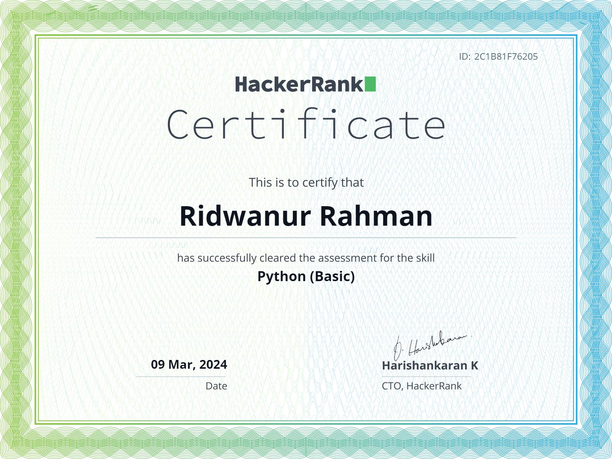
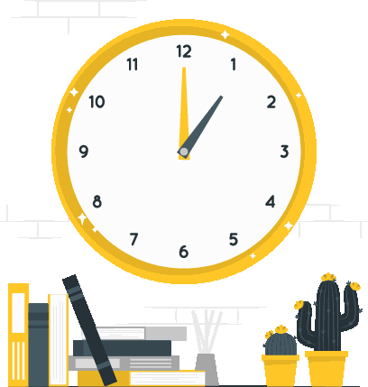

### Ahoy there 👋 
# Welcome to the land of learning something new and exciting.
#### 
Hello, Welcome to my Github profile. My name is Ridwan and currently I am pursuing my Bachelors of Science in Computer Science and Engineering from BRAC University. I am currently enrolled in 6th semester

 

  
   

<h2 align="left">Connect with me:</h1>

  

<h2 align="left">Languages and Tools:</h1>

 
 
 
 

<h2 align="left">Certificates:</h1>

<h3 align="left">Sololearn</h3>
  
  
  

  

<h3 align="left">HackeRank</h3>
  
<h3 align = "left">Codedex</h3>
 <a href = "https://www.codedex.io/certificates/e94a1443-99ca-437f-ba91-8e809db359a2" target= "_blank"> 

  

<h2 align = "center">Projects</h3>

  <ul>
    <li>
   
     </li>
   <li>
   
     </li>
  </ul>

   

**

&nbsp;

**
      

  

  

## #30NitesOfCode:
  [Check out my progress!](https://www.codedex.io/@ridwanurra31653/30-nites-of-code)  
  
<!--
**Ridwan805/Ridwan805** is a ✨ _special_ ✨ repository because its `README.md` (this file) appears on your GitHub profile.

Here are some ideas to get you started:

- 🔭 I’m currently working on ...
- 🌱 I’m currently learning ...
- 👯 I’m looking to collaborate on ...
- 🤔 I’m looking for help with ...
- 💬 Ask me about ...
- 📫 How to reach me: ...
- 😄 Pronouns: ...
- ⚡ Fun fact: ...
-->
