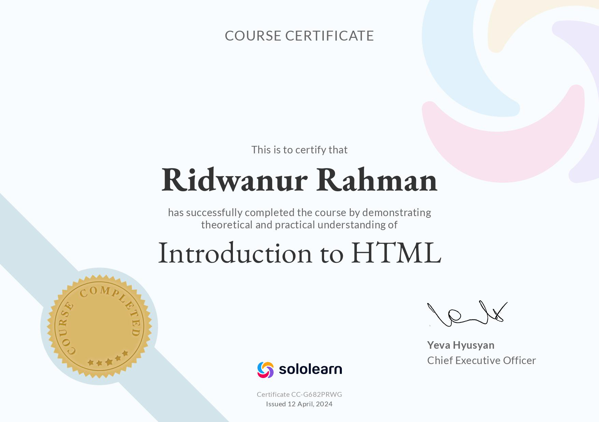
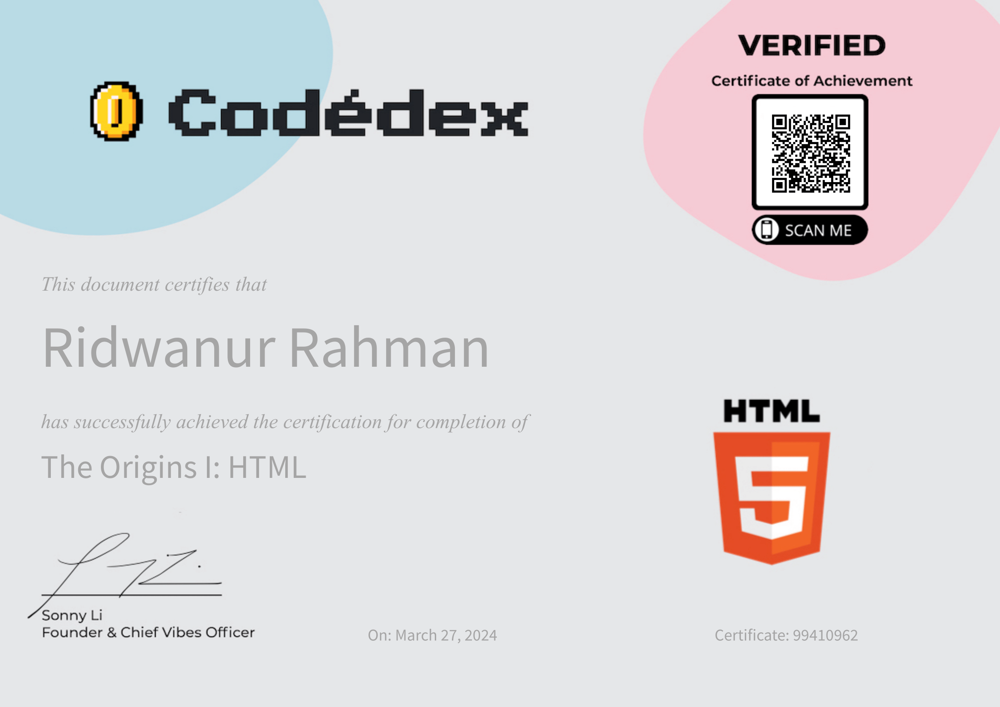

## Ahoy there 👋 
<h1 align = "center"> Welcome to the land of learning something new and exciting.</h1>

Greetings and welcome to my Github profile! I'm Ridwan, currently in pursuit of a Bachelor of Science in Computer Science and Engineering at BRAC University, currently in my 6th semester. At this moment, I'm immersing myself in the realms of HTML <!--and Object-Oriented Programming in C++,--> while also engaging in <a href="#Projects">Projects</a> that employ Python. I hope you'll find them intriguing and worthwhile. Additionally, I'm actively working on broadening my expertise in HTML, CSS, & JavaScript and Tkinter in python to further enhance my skill set. 

    

<!--

  <h3 align = "center">The repos I am currently working On:</h3>
    <h4><a href= "https://github.com/Ridwan805/Tkinter" target ="_blank"><b>Tkinker Library of Python</b></a></h4></li>
    <h4><a href= "https://github.com/Ridwan805/starting-HTML-from-Scratch" target ="_blank"><b>HTML</b></a></h4></li>

-->

  

 

    

<h2 align="left">Connect with me:</h1>

  
  
  
  
  
  
  
  
  

<h2 align="left">Languages and Tools:</h1>

 
  
   
   
   
  
  

<h2 align="center">Certificates:</h1>

<h3 align="center">Sololearn</h3>
  

    
    
    
     
    
  

    
  

<h3 align="center">HackeRank</h3>
  

    
  

   
  
<h3 align = "center">Codedex</h3>
  

   <a href = "https://www.codedex.io/certificates/e94a1443-99ca-437f-ba91-8e809db359a2" target= "_blank">
     
     <a href = "https://www.codedex.io/certificates/29b54bec-6f82-40d5-aa1b-cecd06ae8c8d" target= "_blank">
     
  

  

<h2 class = "heading" id = "Projects" align = "center">Projects</h3>

  <ul>
    <li>
     
   </li>
   <li>
     
    </li>
    <li>
      
    </li>
  </ul>

   

   
   
  
   
  
   

      

  

  

## #30NitesOfCode:
  [Check out my progress!](https://www.codedex.io/@ridwanurra31653/30-nites-of-code)  
  
<!--
**Ridwan805/Ridwan805** is a ✨ _special_ ✨ repository because its `README.md` (this file) appears on your GitHub profile.

Here are some ideas to get you started:

- 🔭 I’m currently working on ...
- 🌱 I’m currently learning ...
- 👯 I’m looking to collaborate on ...
- 🤔 I’m looking for help with ...
- 💬 Ask me about ...
- 📫 How to reach me: ...
- 😄 Pronouns: ...
- ⚡ Fun fact: ...
-->
